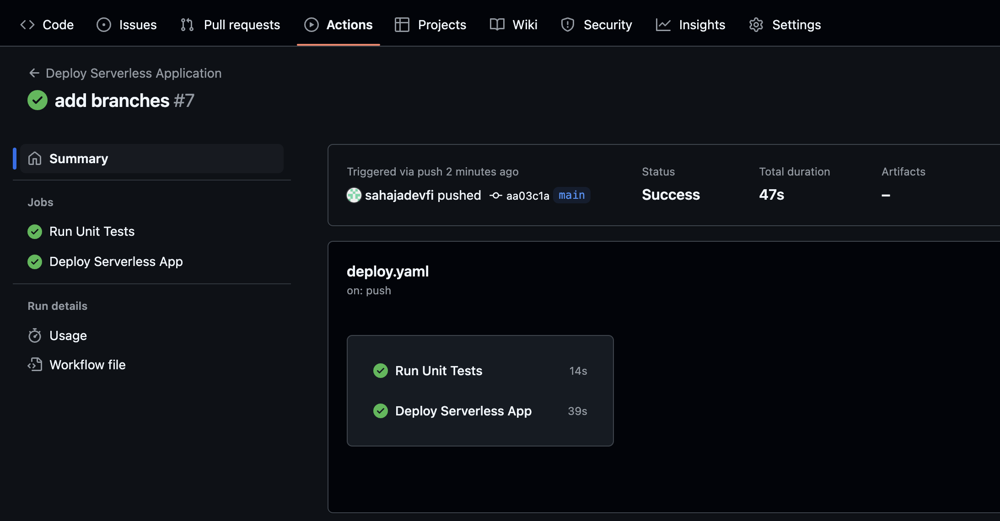

# Deploying serverless application

This project is a Serverless Framework application that provides CRUD operations using AWS Lambda, API Gateway, and DynamoDB. It includes CI/CD automation via GitHub Actions to ensure smooth deployment.

Features:
✅ Serverless CRUD operations on DynamoDB
✅ API Gateway integration with Lambda
✅ CI/CD pipeline using GitHub Actions
✅ Unit tests using pytest and moto
✅ Infrastructure-as-Code (IaC) with serverless.yml

Technologies Used:
1. AWS Lambda (Python)
2. AWS API Gateway
3. DynamoDB
4. Serverless Framework
5. GitHub Actions (CI/CD)
6. Python (pytest, moto for testing)

Setup and Deployment:
1️⃣ Clone the Repository
git clone https://github.com/sahajadevfi/Serverless-Guru.git
cd Serverless-Guru

2️⃣ Install Dependencies
npm install -g serverless  # Install Serverless Framework
If using yarn: yarn install  # or npm install
pip install -r requirements.txt  # Install Python dependencies

3️⃣ Deploy to AWS
Ensure AWS credentials are configured via GitHub secrets or locally using aws configure.
serverless deploy

4️⃣ Run Tests Locally
pytest -v

Workflow Steps (.github/workflows/deploy.yml):

✅ Test Stage (Runs pytest to validate the Lambda function)

✅ Deploy Stage (Deploys only if tests pass)

